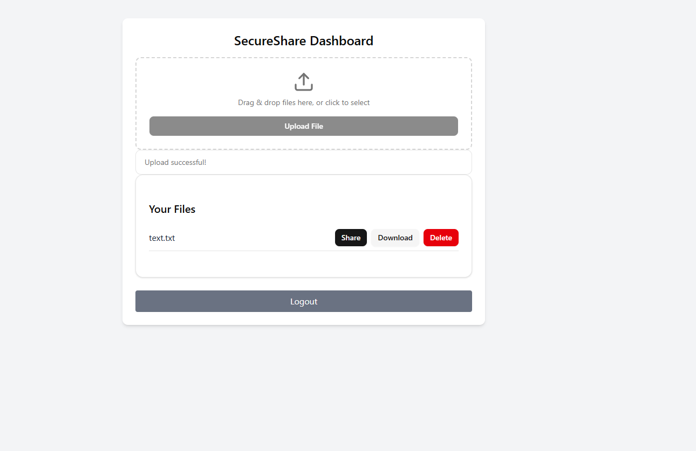

# 📦 SecureShare

> A secure, encrypted file-sharing platform with authentication and link-based sharing.

---

## 📄 Overview

**SecureShare** is a secure file upload, storage, and sharing web application built with **Spring Boot (Java)** for the backend and **React** for the frontend. It supports:

- User authentication (JWT)
- Encrypted file storage using AES
- File upload/download/delete functionality
- Secure shareable download links (with optional password and expiry)
- Role-based access (Admin/User)

---

## 🚀 Features

- 🔐 **User Authentication** (JWT with BCrypt hashing)
- 📤 **File Upload & Download**
- 🧹 **File Deletion with Authorization**
- 🗃️ **Encrypted File Storage (AES)**
- 🔗 **Token-based File Sharing with Optional Password**
- 👮‍♂️ **Role-based Access Control**
- 🔗 **QR Code Sharing**

---

## 🧱 Tech Stack

- **Backend**: Java, Spring Boot, Spring Security, JPA, JWT, AES Encryption  
- **Frontend**: React, TailwindCSS, TypeScript, shadcn/ui
- **Database**: PostgreSQL


## ⚙️ Setup Instructions

### Backend (Spring Boot)

1. Clone repo and `cd src/`
2. Configure `application.yaml`:
3. Run the backend:

```bash
./mvnw spring-boot:run
```

### Frontend (React)

1. `cd secure-share-frontend/`
2. Install dependencies:

```bash
npm install
```

3. Run development server:

```bash
npm run dev
```

---

## 🔐 Authentication Flow

### User Entity

```java
public class User {
  private Long id;
  private String username;
  private String password; // BCrypt hash
  private String role; // ADMIN or USER
}
```

- JWT authentication used for protected endpoints.
- Passwords are hashed with BCrypt.
- Role-based restrictions using `@PreAuthorize` or config.

---

## 📁 File Management

- Files stored in `./uploads/` (or configured path).
- Metadata (filename, path, owner) saved in DB.
- AES used to encrypt before storing.
- Decryption on download.

### API Endpoints

| Method | Endpoint          | Description              |
|--------|-------------------|--------------------------|
| POST   | `/api/v1/files/upload`         | Upload a file            |
| GET    | `/api/v1/files/{id}`     | Download file            |
| DELETE | `/api/v1/files/{id}`     | Delete (if owner/admin)  |

---

## 🔗 Sharing Files

- Generates a UUID-based token and optional password
- Token expires after `X` minutes
- Download via:

```
/api/v1/share/access/{token}?password=optional
```

- Shared link shown in frontend like:

```
https://yourdomain.com/share/access/{token}
```

---
## 🔗 QR Code Sharing

SecureShare now supports **QR code-based file sharing**! 🚀

After generating a shareable link for your file, a **QR code** will also be displayed. This makes it easy to:

- Share files via mobile devices
- Print the QR code for physical distribution
- Use in presentations or offline scenarios

### 🛠️ How It Works

- Backend provides a public endpoint:  
  `GET /api/v1/share/qr/{token}`  
  Returns a PNG QR code image for the share token.

- Frontend fetches and displays the QR code next to the share link.

---

## 📸 Screenshots

### 🔐 Login Page


---

### 🏠 Home Page



---

### Share Link and QR Code


## 🛡️ Security Notes

- AES encryption secures files at rest
- Only authenticated users can upload or manage files
- Shared links can be:
  - Expiry-based
  - Password-protected
- JWT secures user sessions

---

## 📄 License

This project is licensed under the MIT License. Feel free to use, fork, and enhance.
